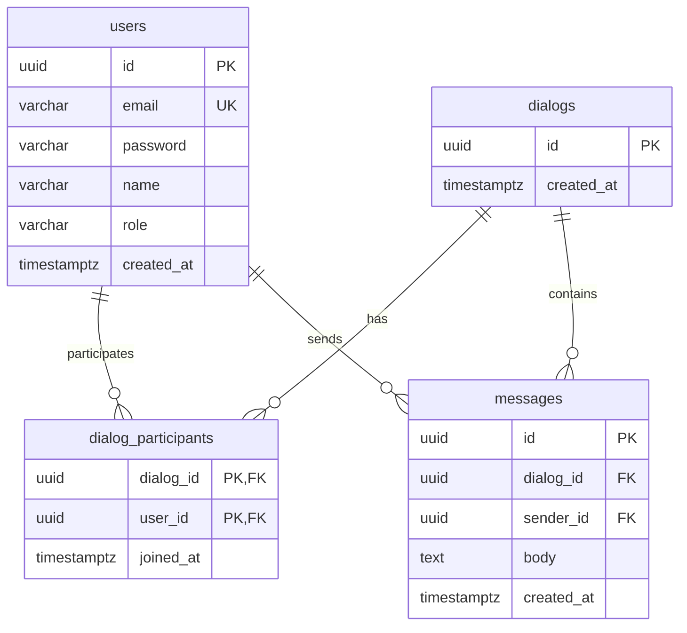

# ER-диаграмма предметной области iMSITChat

## Описание сущностей

- **users** — пользователи (email, пароль в хеше, имя, роль: user/admin).
- **dialogs** — диалоги (личный чат один на один).
- **dialog_participants** — связь многие-ко-многим между пользователями и диалогами (в личном диалоге ровно 2 участника).
- **messages** — сообщения (диалог, отправитель, текст, дата/время).

## Диаграмма (Mermaid)

## Нормализация

- Таблицы в 3НФ: нет повторяющихся групп, все неключевые атрибуты зависят только от первичного ключа.
- Связь пользователь–диалог вынесена в отдельную таблицу `dialog_participants` для поддержки личных диалогов (ровно два участника на диалог).
